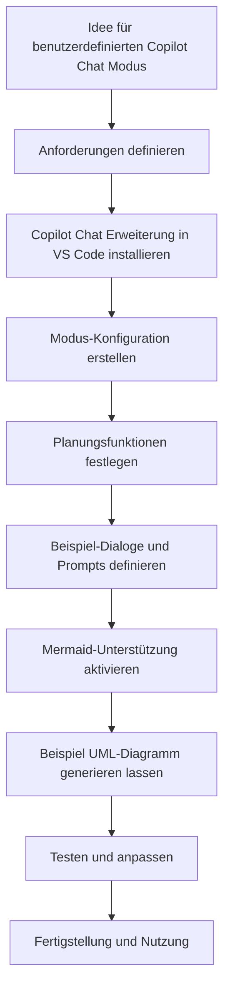

# Diagramm

```mermaid
flowchart TD
    A[Idee für benutzerdefinierten Copilot Chat Modus] --> B[Anforderungen definieren]
    B --> C[Copilot Chat Erweiterung in VS Code installieren]
    C --> D[Modus-Konfiguration erstellen]
    D --> E[Planungsfunktionen festlegen]
    E --> F[Beispiel-Dialoge und Prompts definieren]
    F --> G[Mermaid-Unterstützung aktivieren]
    G --> H[Beispiel UML-Diagramm generieren lassen]
    H --> I[Testen und anpassen]
    I --> J[Fertigstellung und Nutzung]

    click A call linkCallback("/opt/Projekts/Wyverex/Personal-Website/note2.txt")
    click J call linkCallback("/opt/Projekts/Wyverex/Personal-Website/note2.txt")
```
